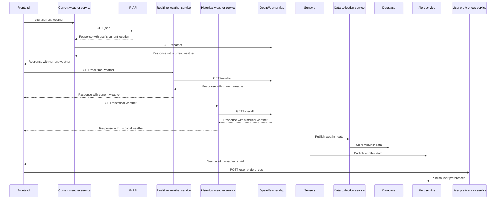
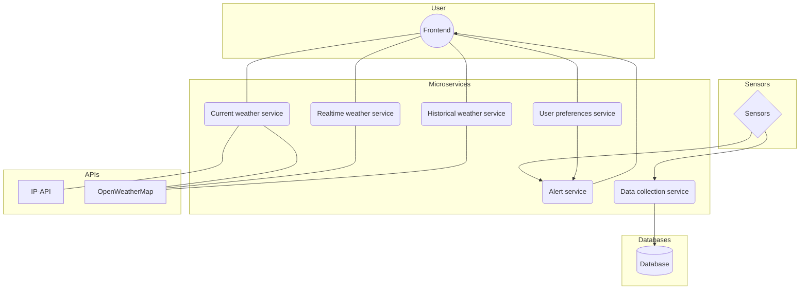

# Weather Monitoring Application with Microservice Architecture

This is a weather monitoring application with microservice architecture. It is a simple application that allows users to monitor the weather at the user's current location, a location searched by the user, or historical weather data for a location.

## Design and Architecture

### Functional Requirements

- The application retrieves weather data from sensors and stores it in a database.
- The application shows the current weather at the user's current location.
- The application shows the current weather at a location searched by the user.
- The application shows historical weather data for a location.
- The application alerts the user when the weather is bad.
- The application allows the user to set preferences for weather alerts.

### Microservices

- Data collection service: This microservice collects weather data from sensors and stores it in a database. The scope of this microservice is limited to data collection and storage. The communication pattern used by this microservice is asynchronous messaging.
- Current weather service: This microservice retrieves the current weather from the database and shows it to the user. The scope of this microservice is limited to obtaining the user's current location using [IP-API](https://ipapi.co/) and retrieving the current weather from [OpenWeatherMap](https://openweathermap.org/). The communication pattern used by this microservice is synchronous request-response.
- Realtime weather service: This microservice retrieves the current weather of a location based on the search query of the user and shows it to the user. The scope of this microservice is limited to retrieving the current weather of a location from [OpenWeatherMap](https://openweathermap.org/). The communication pattern used by this microservice is synchronous request-response.
- Historical weather service: This microservice retrieves historical weather data for a location based on the search query of the user and shows it to the user. The scope of this microservice is limited to retrieving historical weather data for a location from [OpenWeatherMap](https://openweathermap.org/). The communication pattern used by this microservice is synchronous request-response.
- Alert service: This microservice retrieves the current weather from the sensors and checks if the weather is bad. If it is, the alert service sends an alert to the user. The scope of this microservice is limited to accepting weather data and sending alerts. The communication pattern used by this microservice is asynchronous messaging.
- User preferences service: This microservice allows the user to set preferences for weather alerts. The scope of this microservice is limited to storing user preferences. The communication pattern used by this microservice is asynchronous messaging.

### Communication Patterns

The communication pattern used in the weather monitoring system is a mix of synchronous request/response and asynchronous messaging. Synchronous request/response is used when a microservice needs to get data from another microservice in real-time. Asynchronous messaging is used when a microservice needs to send data to another microservice, but the response can be delayed.

### Sequence Diagram



### Architecture Diagram



### Limitations

The limitations around communication for microservices include increased complexity, potential latency, and the need for error handling. Because each microservice is a separate process, there is a potential for increased latency in communication between microservices. Additionally, error handling must be carefully implemented to ensure that failures in one microservice do not propagate to other microservices. Finally, the increased complexity of microservice-based architectures can make them harder to design, develop, deploy, and maintain than monolithic architectures.

## Implementation

### Microservices

Three microservices were implemented:

- Current weather service: This microservice obtains the geographic coordinates of the user's current location using [IP-API](https://ipapi.co/) and retrieves the current weather from [OpenWeatherMap](https://openweathermap.org/). The frontend sends requests to this microservice by using the `GET /current-weather` endpoint. The microservice responds with the current weather in JSON format.

- Realtime weather service: This microservice retrieves the current weather of a location from [OpenWeatherMap](https://openweathermap.org/) based on the given location entered by the user. The frontend sends requests to this microservice by using the `GET /real-time-weather` endpoint. The microservice responds with the current weather in JSON format.

- Historical weather service: This microservice retrieves historical weather data for a location from [OpenWeatherMap](https://openweathermap.org/) based on the given location and UNIX timestamp entered by the user . The frontend sends requests to this microservice by using the `GET /historical-weather` endpoint. The microservice responds with historical weather data in JSON format.

### Dependencies

The following dependencies were used in the implementation of the microservices:

- Node.js
- React
  - express
  - axios
  - dotenv

### Deployment

First navigate to the src directory of the microservice you want to deploy.

```bash
cd src
```

Then run the following command in separate terminals to start the microservices.

```bash
node current.js
node realtime.js
node historical.js
```

And run the following command in the root directory to start the frontend.

```bash
npm start
```
